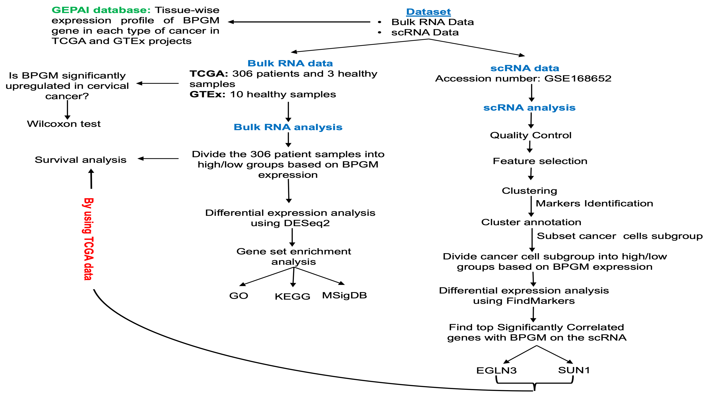

# 🔬 Integrated Analysis of Bulk and Single-Cell Transcriptomics in Cervical Cancer

This repository accompanies the study:

**📄 Citation**  
> Elsherif, A. K., Emam, M., Abushady, A. M., Gamaleldin, M., Al-Atabany, W., & Elhadidi, M. (2023).  
> *Integrated Analysis of Bulk and Single-Cell Transcriptomics in Cervical Cancer: Insights into BPGM, EGLN3, and SUN1*.  
> 2023 IEEE 23rd International Conference on Bioinformatics and Bioengineering (BIBE).  
> [https://doi.org/10.1109/BIBE60311.2023.00023](https://doi.org/10.1109/BIBE60311.2023.00023)

---
## 📚 Table of Contents
- [Overview](#-overview)
- [Workflow Diagram](#-analysis-workflow)
- [Repository Structure](#-repository-structure)
- [Data Sources](#-data-sources)
- [Setup](#️-setup-and-requirements)
- [Outputs](#-outputs)
- [Author](#-author)
- [Keywords](#-keywords)
- [License](#-license)


## 🧪 Overview

This project integrates bulk and single-cell RNA-seq data to explore the expression and clinical relevance of **BPGM**, **EGLN3**, and **SUN1** in cervical cancer.

### 🔬 Flow of Analysis

1. **Bulk RNA-seq**: TCGA-CESC dataset — normalization, differential expression, enrichment analysis.
2. **Single-cell RNA-seq**: GSE168652 — clustering, annotation, expression of target genes.
3. **Survival analysis**: Assess prognostic value of BPGM using Kaplan–Meier plots and log-rank tests.

---

## 🧭 Analysis Workflow

Below is the complete analysis pipeline integrating TCGA bulk RNA-seq, GEO single-cell data, and clinical survival data:



---

## 📁 Repository Structure

```
.
├── workflow_diagram.png               # Full analysis workflow
├── Bulk_RNA_Analysis.R                # TCGA preprocessing, DE analysis, and enrichment
├── scRNA_seq_analysis.R              # Seurat pipeline for single-cell analysis
├── Survival_Analysis_Wilcoxon_Test.R # BPGM survival analysis, Wilcoxon test, and plotting
├── README.md                         # Project documentation
```

---

## 📂 Data Sources

### 🔸 Bulk RNA-seq Data
- **Source**: TCGA-CESC (Cervical Squamous Cell Carcinoma and Endocervical Adenocarcinoma)
- **Access**: [https://portal.gdc.cancer.gov/](https://portal.gdc.cancer.gov/)
- **Format**: STAR-aligned raw counts and clinical data

### 🔸 Single-cell RNA-seq Data
- **Source**: GEO dataset [GSE168652](https://www.ncbi.nlm.nih.gov/geo/query/acc.cgi?acc=GSE168652)
- **Format**: 10X Genomics matrices (normal and tumor samples)

### 🔸 Normal Tissue Expression (for comparison)
- **Source**: GTEx endocervix samples (via UCSC Xena or Recount2)

---

## ⚙️ Setup and Requirements

Install all necessary R packages:

```r
if (!requireNamespace("BiocManager", quietly = TRUE))
    install.packages("BiocManager")

# CRAN packages
install.packages(c(
  "tidyverse", "readr", "ggplot2", "data.table",
  "pheatmap", "forcats", "cowplot"
))

# Bioconductor packages
BiocManager::install(c(
  "org.Hs.eg.db",
  "AnnotationDbi",
  "DESeq2",
  "EnhancedVolcano",
  "clusterProfiler",
  "DOSE",
  "msigdbr",
  "TCGAbiolinks",
  "SummarizedExperiment",
  "survminer",
  "survival",
  "Seurat"
))
```

---

## 📊 Outputs

- 🧬 **Bulk RNA-seq**: DEG results, volcano plot, GO/KEGG/MSigDb enrichment
- 🔎 **Single-cell**: t-SNE plots, cluster markers, manual annotation of TME
- 📈 **Survival**: Kaplan–Meier plots, log-rank p-values for BPGM
- 🎻 **Expression**: Violin plot comparing BPGM in tumor vs. normal

---

## 👨‍💻 Author

**Assem K. Elsherif**  
School of Biotechnology, Nile University, Egypt  
[LinkedIn Author Profile](https://www.linkedin.com/in/assem-kadry-elsherif-ab401213a/)

---

## 🧠 Keywords

`Cervical Cancer` · `Bulk RNA-seq` · `Single-cell RNA-seq` · `BPGM` · `TCGA` · `GEO` · `Seurat` · `Survival Analysis`

---

## 📜 License

This project is licensed under the MIT License.
